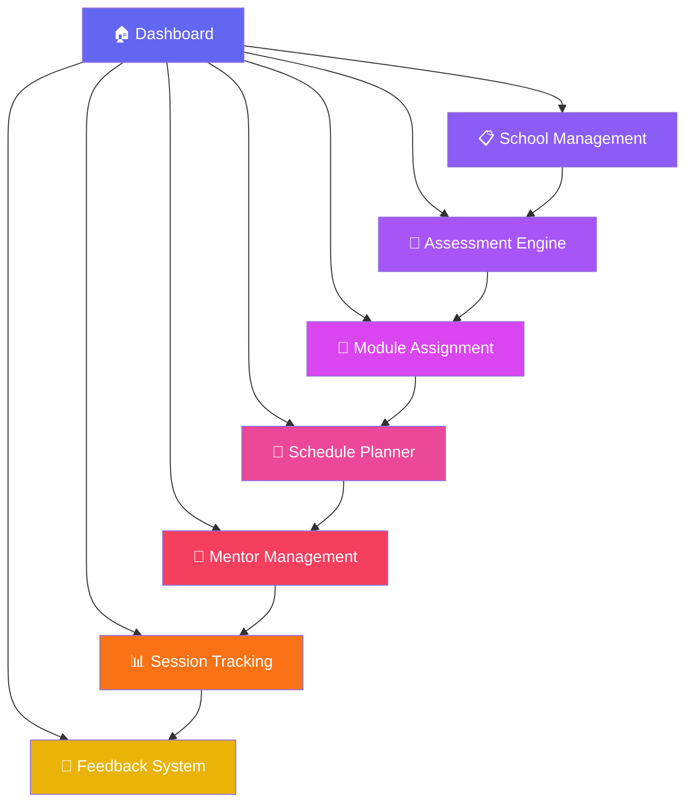
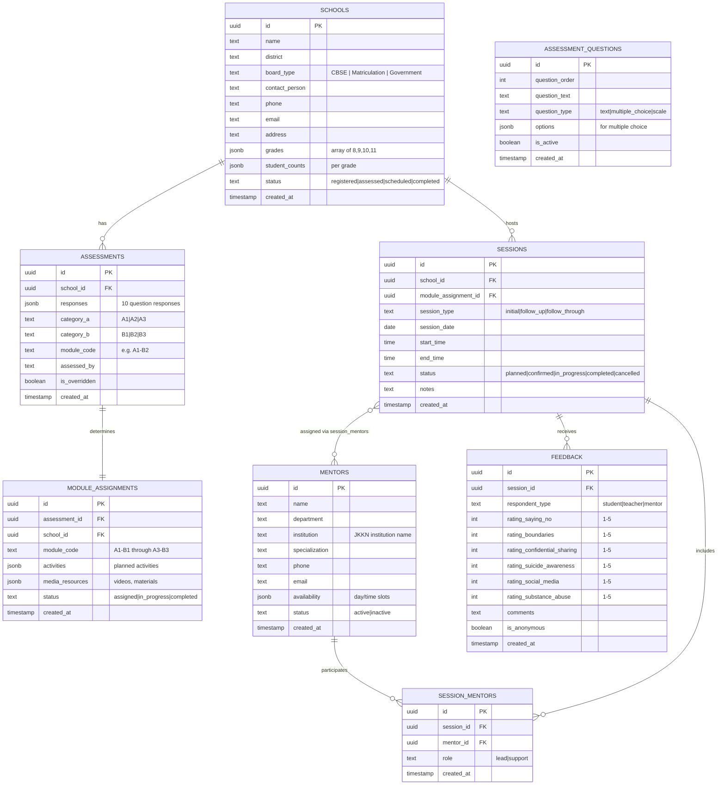

# YI Erode Chapter — Substance Abuse Awareness Platform

**"Project Shield"** — A unified platform for the Young Indians Erode Chapter to manage school assessments, module deployment, mentor allocation, scheduling, and post-session feedback for substance abuse awareness programs across Tamil Nadu.

---

## User Review Required

> [!IMPORTANT]
> **Project Name**: I've used "Project Shield" as a working name. Please confirm or suggest an alternative.

> [!IMPORTANT]
> **Supabase Project**: You have two inactive Supabase projects. Should I:
> - **(A)** Restore one of the existing projects (`krishnabiochem85-cyber's Project` or `weave-smart-data`)?
> - **(B)** Create a new Supabase project dedicated to this platform?
> Creating a new project on the free plan costs **$0/month**.

> [!WARNING]
> **Authentication Strategy**: Who will use this platform?
> 1. **Admin-only** — Only YI Erode Chapter team & JKKN coordinators log in. Schools fill forms via public links.
> 2. **Multi-role** — Admins, School Coordinators, and Mentors each have login accounts with different permissions.
> Please confirm which model you prefer.

> [!IMPORTANT]
> **The 10 Assessment Questions**: Could you share the actual 10 questions for the Module Planning Assessment? I'll build the form around your exact questions. For now, I'll design the schema to support 10 configurable questions.

---

## Tech Stack

| Layer | Technology | Rationale |
|-------|-----------|-----------|
| **Frontend** | Next.js 14 (App Router) | SSR, file-based routing, React Server Components |
| **Styling** | Vanilla CSS with custom design system | Premium dark/gradient UI, full control |
| **Backend/DB** | Supabase (Postgres + Auth + Storage) | Real-time, RLS, free tier, MCP integration |
| **Hosting** | Vercel (or local dev) | Seamless Next.js deployment |
| **Charts** | Chart.js / Recharts | Dashboard analytics |

---

## Application Architecture



---

## Proposed Features — 7 Core Modules

### Module 1: Dashboard (Home)
- Overview cards: Total schools registered, sessions completed, upcoming sessions, active mentors
- Quick stats: Schools by category (A1/A2/A3), student behavioral distribution (B1/B2/B3)
- 3×3 heatmap showing module assignment distribution
- Recent activity feed
- The **Six Pillars** visual display

### Module 2: School Management
- Register new schools (name, district, board type, contact person, phone, email, address)
- Board types: CBSE, Matriculation, Government
- Grade selection: 8, 9, 10, 11
- Student count per grade
- School status tracking (Registered → Assessed → Scheduled → Completed)
- Search, filter, and export school list

### Module 3: Assessment Engine (Module Planning Assessment)
- **Public assessment form** (shareable link to school coordinators)
- 10 configurable questions (text, multiple-choice, scale-based)
- Automatic categorization logic:
  - **Category A** (Demographic): Auto-derived from board type + student awareness level
  - **Category B** (Behavioral): Derived from assessment responses
- Result: Assigns a module code (e.g., `A1-B2`, `A3-B3`)
- Assessment review & override by admin

### Module 4: Module Assignment (The 3×3 Matrix)
- Visual 3×3 grid showing all 9 modules
- Each module contains:
  - Target audience description
  - Recommended media & activities
  - Session duration & structure
  - Six Pillars coverage plan
- Auto-assignment based on assessment, with manual override capability
- Module deployment checklist

### Module 5: Schedule Planner
- Calendar view (month/week/day)
- Create session schedules: School, Date, Time, Duration, Module, Assigned Mentors
- Conflict detection (mentor double-booking)
- Session status: Planned → Confirmed → In Progress → Completed
- Notification-ready (future: SMS/email integration)

### Module 6: Mentor Management
- Mentor registry from JKKN institutions
- Mentor profiles: Name, department, specialization, availability, experience
- Allocation engine: Assign mentors to sessions based on availability & module expertise
- Mentor workload dashboard
- Performance tracking (sessions conducted, feedback scores)

### Module 7: Feedback & Analytics
- **Post-session feedback forms** (for students, teachers, mentors)
- Quantitative ratings (1-5 scale on six pillars)
- Qualitative feedback (open text)
- Analytics dashboard:
  - Session effectiveness by module type
  - Six Pillars impact scores
  - School-wise progress tracking
  - District-level heatmap
- Export reports (CSV/PDF)

---

## Database Schema



---

## UI Design Direction

- **Theme**: Deep dark mode with gradient accents (indigo → violet → rose)
- **Typography**: Inter (Google Fonts)
- **Design Language**: Glassmorphism cards, subtle animations, vibrant accent colors
- **Navigation**: Sidebar with icons + labels, collapsible on mobile
- **Responsive**: Fully responsive — desktop-first but mobile-friendly
- **Color Palette**:
  - Background: `#0f0f1a` → `#1a1a2e`
  - Cards: `rgba(255,255,255,0.05)` with blur
  - Primary: `#6366f1` (Indigo)
  - Secondary: `#a855f7` (Purple)
  - Accent: `#ec4899` (Pink)
  - Success: `#10b981`
  - Warning: `#f59e0b`
  - Danger: `#ef4444`

---

## Project Structure

```
d:\yi-erode-shield/
├── app/
│   ├── layout.js              # Root layout with sidebar
│   ├── page.js                # Dashboard
│   ├── globals.css            # Design system
│   ├── schools/
│   │   ├── page.js            # School list
│   │   └── [id]/page.js       # School detail
│   ├── assessments/
│   │   ├── page.js            # Assessment list
│   │   └── new/page.js        # New assessment form
│   ├── modules/
│   │   └── page.js            # 3x3 Matrix view
│   ├── schedule/
│   │   └── page.js            # Calendar & scheduling
│   ├── mentors/
│   │   ├── page.js            # Mentor list
│   │   └── [id]/page.js       # Mentor profile
│   ├── feedback/
│   │   ├── page.js            # Feedback analytics
│   │   └── form/[sessionId]/page.js  # Public feedback form
│   └── api/                   # API routes (if needed)
├── components/
│   ├── Sidebar.js
│   ├── DashboardCards.js
│   ├── AssessmentMatrix.js
│   ├── CalendarView.js
│   ├── MentorCard.js
│   ├── FeedbackChart.js
│   └── ...
├── lib/
│   ├── supabase.js            # Supabase client
│   └── utils.js               # Helper functions
├── public/
│   └── assets/
├── package.json
└── next.config.js
```

---

## Phased Build Approach

### Phase 1 — Foundation (Current Sprint)
1. Set up Next.js project + Supabase backend
2. Create database schema (all tables + RLS policies)
3. Build design system (globals.css)
4. Build sidebar navigation + layout
5. Dashboard with placeholder data

### Phase 2 — Core Data Entry
6. School registration (CRUD)
7. Assessment form (10 questions + auto-categorization)
8. 3×3 Module Matrix display + assignment

### Phase 3 — Operations
9. Session scheduling + calendar
10. Mentor management + allocation
11. Conflict detection

### Phase 4 — Feedback & Analytics
12. Post-session feedback forms
13. Analytics dashboard with charts
14. Export capabilities

### Phase 5 — Polish
15. Public shareable links (assessment + feedback)
16. Mobile responsiveness refinements
17. Performance optimization

---

## Open Questions

> [!IMPORTANT]
> 1. **What are the 10 Module Planning Assessment questions?** This is critical for building the assessment engine and auto-categorization logic.

> [!IMPORTANT]
> 2. **Module content details**: Do you have specific media, activities, and session structures defined for each of the 9 modules (A1-B1 through A3-B3)? Or should I create placeholder templates?

> [!NOTE]
> 3. **JKKN Institutions**: How many JKKN institutions will mentors come from? Is there a fixed list?

> [!NOTE]
> 4. **Districts covered**: Should I include all Tamil Nadu districts, or a specific subset around the Erode region?

> [!NOTE]
> 5. **Session types**: You mentioned "follow-up" and "follow-through" sessions. How many follow-up sessions are typical per school? Is there a fixed cadence?

> [!NOTE]
> 6. **Public access**: Should the assessment form and feedback form be publicly accessible (no login required), while the management features require admin login?

---

## Verification Plan

### Automated Tests
- Database migration verification via Supabase MCP
- Browser-based UI testing for all 7 modules
- Form submission and data persistence checks

### Manual Verification
- Walk through full workflow: Register school → Assess → Assign module → Schedule → Allocate mentor → Conduct → Collect feedback
- Verify 3×3 matrix categorization logic against sample data
- Mobile responsiveness check across viewports
